  

###

<h1 align="center">Привет👋 Меня зовут Максим!</h1>

###

  
  

###

  

###

<h3 align="left">👨‍💻 Обо мне</h3>

###

Я специалист по автоматизации бизнес-процессов. Помогаю компаниям избавиться от ручной рутины: нахожу операции, на которые сотрудники тратят часы, и превращаю их в автоматические системы, которые работают каждый день без участия человека. Более 5 лет коммерческого опыта и инженерное образование.

<b>Что автоматизирую:</b>

- обработку входящей почты и документов с извлечением данных, в том числе с помощью AI;
- обмен данными между системами: 1С, системы бронирования и учёта, Excel, Google Sheets;
- управленческую отчётность и KPI-дашборды для руководства;
- планирование, учёт и расчётные модели на производстве.

<b>Как работаю:</b> разбираю процесс и считаю, сколько он стоит сейчас → пишу ТЗ → разрабатываю и внедряю → обучаю сотрудников и оставляю документацию → измеряю результат.

Опыт в туризме, IT-интеграции и на производстве. Инструменты подбираю под задачу: VBA, Google Apps Script, Power BI, 1С и интеграции с LLM.

###

<h3 align="left">📈 Результаты в цифрах</h3>

###

| Проект | Было | Стало |
|---|---|---|
| Обработка стопов и цен отелей → Самотур | 3 часа в день | **5 минут** |
| Отчётность по техобслуживанию (1С:ТОиР) | 2 дня | **15 минут** |
| Расчёт и документация трансформаторов | — | **в 1,5 раза быстрее, меньше ошибок** |
| Адаптация новых сотрудников | 1 месяц | **2 недели** |
| Система учёта обращений | почта и чаты | **30+ пользователей в едином реестре** |

###

<h3 align="left">🗂 Проекты</h3>

###

<table>
  <tr>
    <td width="50%"> <b>Стопы и цены отелей → Самотур</b> VBA · Outlook · RegExp · LLM</td>
    <td width="50%"> <b>KPI-дашборд техобслуживания</b> Apps Script · Google Sheets · 1С:ТОиР</td>
  </tr>
  <tr>
    <td width="50%"> <b>Учёт обращений и инцидентов</b> Apps Script · SLA · аналитика</td>
    <td width="50%"> <b>Расчёт трансформаторов на VBA</b> Excel VBA · UserForms · генерация документов</td>
  </tr>
</table>

  

###

<h3 align="left">🛠 Технологии</h3>

###

  
  
  
  
  
  
  
  
  
  
  
  
  
  
  
  

###

<h3 align="left">🔥 Моя статистика</h3>

###

  

###

  
  

###
